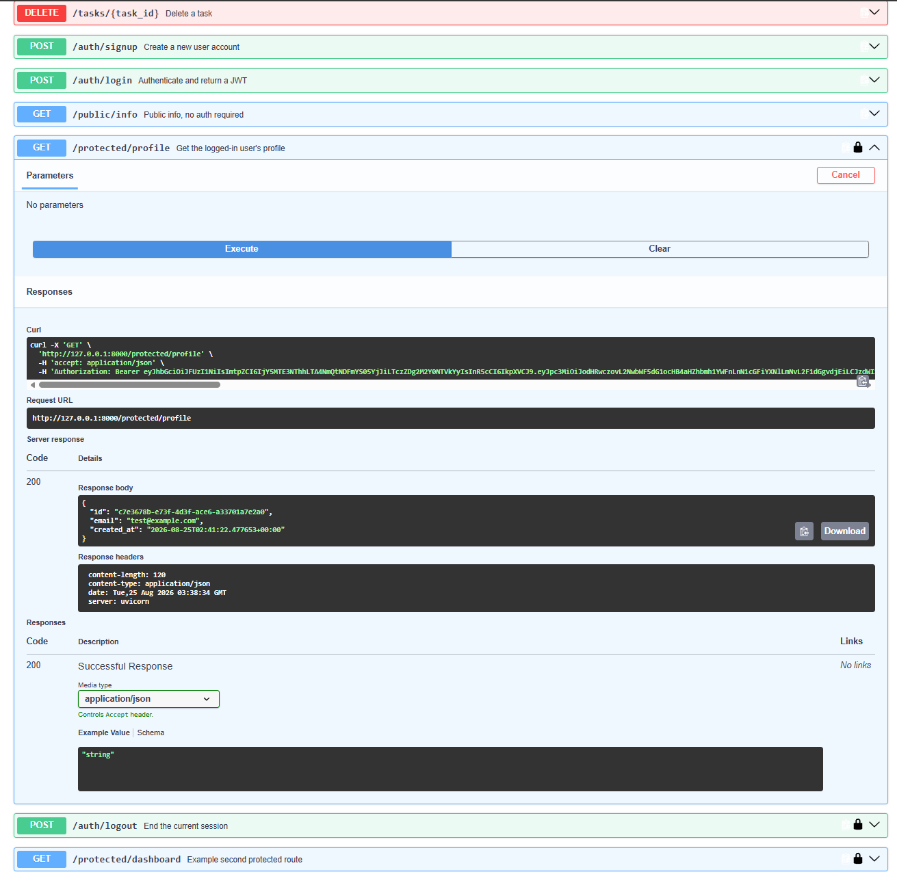
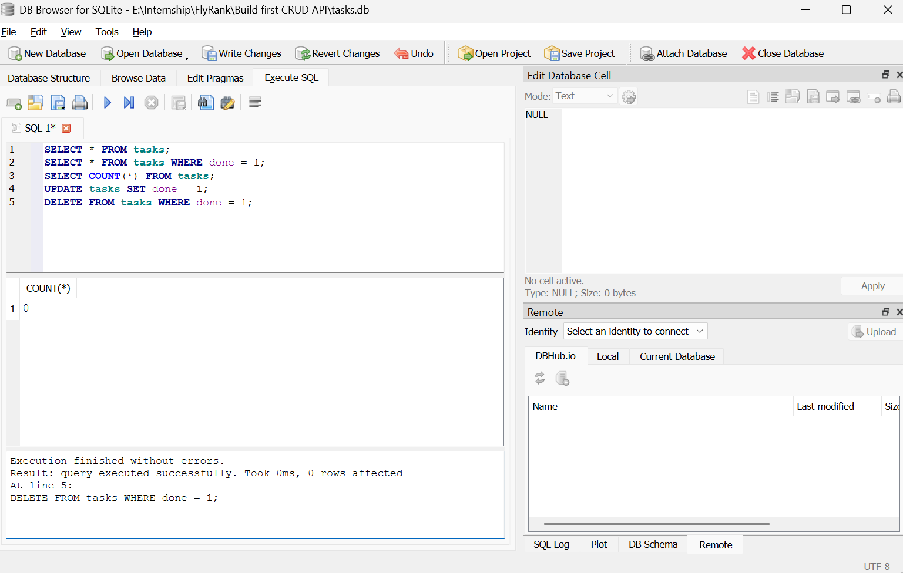

# Task API

A CRUD API for managing a to-do list, built with FastAPI as part of the FlyRank Backend AI Engineering internship. The project has evolved across four stages while its task endpoints stayed functionally identical:

1. **In-memory** — data lost on restart
2. **SQLite** — data in a single file, survives a restart
3. **PostgreSQL in Docker** — a real database server, containerized, started with one command
4. **Auth with Supabase** — the API is no longer wide open; protected routes require a verified login

## What this is

A REST API for managing tasks (CRUD, backed by Postgres in Docker) plus a full authentication layer: sign up, log in, log out, and route-level protection using Supabase as the Identity Provider.

## Architecture

- `repository.py` — all task-related SQL, implementing `list_tasks`, `get_task`, `create_task`, `update_task`, `delete_task`, `get_stats`. Routes never contain SQL.
- `auth.py` — initializes the Supabase client from environment variables.
- `main.py` — routes only. Auth routes call the Supabase SDK directly (signup/login/logout); protected routes use a single reusable dependency, `get_current_user`, which verifies the bearer token with Supabase before the route body runs.

## How to run it

**Requires:** Docker Desktop (or Podman) installed and running, plus a free Supabase project.

1. Create a project at [supabase.com](https://supabase.com), then under **Project Settings → API Keys**, copy your **Project URL** and **Publishable key**. Under **Authentication → Providers → Email**, turn off "Confirm email" for local testing.

2. Copy the example environment file and fill in your real values:
```bash
cp .env.example .env
```

3. Start the whole stack:
```bash
docker compose up
```

The `tasks` table is created automatically and seeded with 3 example tasks on first run. Visit `http://localhost:8000/docs` for interactive API documentation, including a bearer-token "Authorize" button for the protected routes.

**Running without Docker** (local development): `pip install -r requirements.txt --break-system-packages`, ensure Postgres is reachable at the URL in `.env`, then `uvicorn main:app --reload --port 8000`.

## Environment variables

See `.env.example`.

| Variable | Description |
|----------|-------------|
| `DATABASE_URL` | Postgres connection string (`db` as host inside Docker Compose, `localhost` when run locally) |
| `SUPABASE_URL` | Your Supabase project URL |
| `SUPABASE_KEY` | Your Supabase **Publishable key** (safe to use client-side — never use the Secret key here) |
| `PORT` | Port the app listens on (8000) |

`.env` is git-ignored — never commit real credentials.

## Endpoints

| Method | Path | Auth required? | Description | Success code |
|--------|------|-----------------|--------------|---------------|
| GET | `/` | No | API info | 200 |
| GET | `/health` | No | Health check | 200 |
| GET | `/public/info` | No | Public message | 200 |
| POST | `/auth/signup` | No | Create a Supabase user account | 201 (400 if missing fields) |
| POST | `/auth/login` | No | Log in, returns access + refresh tokens | 200 (400 missing fields, 401 wrong credentials) |
| POST | `/auth/logout` | **Yes** | End the current session | 204 |
| GET | `/protected/profile` | **Yes** | Get the logged-in user's id/email/created_at | 200 (401 if missing/invalid token) |
| GET | `/protected/dashboard` | **Yes** | Example second protected route, same guard reused | 200 (401 if missing/invalid token) |
| GET | `/tasks` | No | List tasks (supports `?search=`, `?done=`, `?sort=title`) | 200 |
| GET | `/tasks/{task_id}` | No | Get one task | 200 (404 if not found) |
| POST | `/tasks` | No | Create a task | 201 (400 if title missing/empty) |
| PUT | `/tasks/{task_id}` | No | Update a task's title | 200 (404 not found, 400 invalid) |
| DELETE | `/tasks/{task_id}` | No | Delete a task | 204 (404 if not found) |
| GET | `/stats` | No | Task counts computed in SQL | 200 |

## Example auth flow

```powershell
# Sign up
Invoke-WebRequest -UseBasicParsing -Uri http://localhost:8000/auth/signup -Method POST -Body '{"email":"test@example.com","password":"password123"}' -ContentType "application/json"
# -> 201, Supabase user object

# Log in
Invoke-WebRequest -UseBasicParsing -Uri http://localhost:8000/auth/login -Method POST -Body '{"email":"test@example.com","password":"password123"}' -ContentType "application/json"
# -> 200, { "access_token": "...", ... }

# Call a protected route
Invoke-WebRequest -UseBasicParsing -Uri http://localhost:8000/protected/profile -Headers @{Authorization="Bearer <access_token>"}
# -> 200, { "id": "...", "email": "...", ... }
```

Changing even one character of a valid token and retrying the same request returns `401 {"detail":"Invalid or expired token"}` — proving Supabase is genuinely verifying the token's signature, not just checking that *something* was sent.

## Swagger UI with bearer auth

`/docs` shows a padlock icon on every protected route. Click **Authorize**, paste an access token (no need to type "Bearer " — Swagger adds it), and "Try it out" works directly from the browser with no curl needed.



## A debugging note worth keeping

Requests to newly added routes kept returning `404`/stale behavior even after saving `main.py`, despite `uvicorn --reload` running. The actual cause: `docker compose`'s `api` container was also bound to port 8000, serving an old Docker image built days earlier — so local requests were silently hitting stale containerized code instead of the locally edited file. Fixed by stopping the compose `api` container (`docker stop buildfirstcrudapi-api-1`) while doing local development, since only one process can hold a port at a time. Worth remembering: running the same port both locally and in Docker Compose simultaneously is a silent trap, not an error message.

## Exploring SQLite directly

Before moving to Postgres, this project ran on SQLite (`tasks.db`). Opened it in DB Browser for SQLite and ran several queries by hand, including `UPDATE tasks SET done = 1;` followed by `DELETE FROM tasks WHERE done = 1;` — since the `UPDATE` had no `WHERE` clause, it marked every task done, and the `DELETE` removed all of them. A direct demonstration of why unscoped `UPDATE`/`DELETE` statements are dangerous in a real system.

## Database viewer


