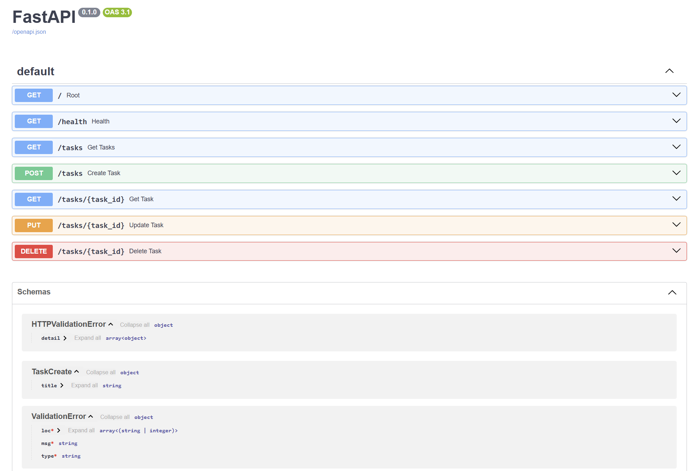

# Task API

A CRUD API for managing a to-do list, built with FastAPI as part of the FlyRank Backend AI Engineering internship. Originally in-memory (Week 2, Assignment BE-01), now backed by a real SQLite database (Week 3, Assignment A2) — the API behaves identically, but data now survives a server restart.

## What this is

A REST API that supports Create, Read, Update, and Delete operations on a list of tasks. Data is stored in a SQLite database (`tasks.db`), created automatically the first time the app runs.

## Why SQLite

SQLite needs no separate server or installation — the entire database is a single file that Python's built-in `sqlite3` module creates automatically. It's the simplest way to move from "data disappears on restart" to "data persists," without the setup overhead of a full database server like Postgres. That tradeoff (zero-config, single-file, single-machine) is the right fit for this stage of the project.

## Where the database file is stored

`tasks.db`, created automatically in the project root the first time the app starts. It's git-ignored (see `.gitignore`) — each fresh clone creates and seeds its own database rather than inheriting one.

## How to run it

1. Install dependencies:
```bash
pip install fastapi uvicorn --break-system-packages
```

2. Start the server:
```bash
uvicorn main:app --reload --port 8000
```

3. Visit `http://localhost:8000/docs` for interactive API documentation.

On first run, `tasks.db` and the `tasks` table are created automatically, seeded with 3 example tasks.

## Endpoints

| Method | Path | Description | Success code |
|--------|------|-------------|--------------|
| GET | `/` | API info | 200 |
| GET | `/health` | Health check | 200 |
| GET | `/tasks` | List all tasks | 200 |
| GET | `/tasks/{task_id}` | Get one task | 200 (404 if not found) |
| POST | `/tasks` | Create a task | 201 (400 if title missing/empty) |
| PUT | `/tasks/{task_id}` | Update a task's title | 200 (404 if not found, 400 if invalid) |
| DELETE | `/tasks/{task_id}` | Delete a task | 204 (404 if not found) |

## Example request

```powershell
Invoke-WebRequest -UseBasicParsing -Uri http://localhost:8000/tasks -Method POST -Body '{"title":"Buy milk"}' -ContentType "application/json"
```

```
StatusCode        : 201
StatusDescription : Created
Content           : {"id":4,"title":"Buy milk","done":0}
RawContent        : HTTP/1.1 201 Created
                    Content-Length: 40
                    Content-Type: application/json
                    Date: Sat, 08 Aug 2026 03:02:09 GMT
                    Server: uvicorn

                    {"id":4,"title":"Buy milk","done":0}
Forms             :
Headers           : {[Content-Length, 40], [Content-Type, application/json], [Date, Sat, 08 Aug 2026 03:02:09
                    GMT], [Server, uvicorn]}
Images            : {}
InputFields       : {}
Links             : {}
ParsedHtml        :
RawContentLength  : 40
```

## Persistence proof

Created a task via POST, restarted the server completely, and confirmed via both `GET /tasks` and a direct SQLite query that the task was still present — proving the data lives in the file, not in memory.

## Exploring the database directly (Stage 4)

Opened `tasks.db` in DB Browser for SQLite and ran several queries by hand, including:

```sql
SELECT * FROM tasks;
SELECT * FROM tasks WHERE done = 1;
SELECT COUNT(*) FROM tasks;
UPDATE tasks SET done = 1;
DELETE FROM tasks WHERE done = 1;
```

Running `UPDATE` without a `WHERE` clause marked every task as done, so the following `DELETE` removed all of them — a direct demonstration of why unscoped `UPDATE`/`DELETE` statements are dangerous in a real system. `GET /tasks` on the running API reflected the empty table instantly, with no restart needed, proving the API and DB Browser read the exact same file with no syncing step in between.

**Example query:**
```sql
SELECT COUNT(*) FROM tasks;
```
**Result:** `0` — returned after running `UPDATE tasks SET done = 1;` followed by `DELETE FROM tasks WHERE done = 1;` on the seeded table. The `UPDATE` had no `WHERE` clause, so it marked every task as done, and the following `DELETE` removed all of them — a direct demonstration of why unscoped `UPDATE`/`DELETE` statements are dangerous in a real system.
 
`GET /tasks` on the running API reflected the empty table instantly, with no restart needed, proving the API and DB Browser read the exact same file with no syncing step in between.

## Swagger UI



## Database viewer


