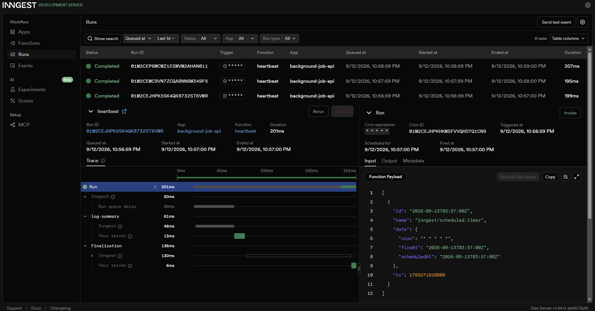

# First Background Job

A small API where slow work happens in the background instead of inside the request: the endpoint answers instantly with `202`, an Inngest function does the real work (a real LLM call, not a fake sleep), a status endpoint reports progress, and one cron job runs on the clock alone.

## What this is

`POST /reports` accepts a topic and returns immediately — it does no slow work itself. It sends an event to Inngest, which triggers a background function that first sleeps 8 seconds (a stand-in slow step) and then calls a real LLM (via OpenRouter) to write a short paragraph about the topic. `GET /reports/:id` lets the client poll for the result: `pending` first, `done` with the generated text once it finishes. A separate `heartbeat` function runs every minute on a cron schedule with no request or event involved at all, logging a summary of how many reports are pending/done/failed.

## How to run it

**Two terminals required.**

Terminal 1 — the API:
```bash
pip install fastapi uvicorn inngest openai python-dotenv
cp .env.example .env   # then add your real OpenRouter key
uvicorn main:app --reload --port 8002
```

Terminal 2 — the Inngest dev server:
```bash
npx inngest-cli@latest dev -u http://localhost:8002/api/inngest
```

Open `http://localhost:8288` for the dashboard.

## Environment variables

| Variable | Description |
|----------|-------------|
| `OPENROUTER_API_KEY` | Your OpenRouter API key |
| `OPENAI_BASE_URL` | `https://openrouter.ai/api/v1` |
| `OPENAI_MODEL` | `openrouter/free` |

## Endpoints & functions

| Type | Name | Trigger | What it does |
|------|------|---------|--------------|
| Endpoint | `GET /health` | HTTP request | `{"status": "ok"}` |
| Endpoint | `POST /reports` | HTTP request | Validates input, sends `report/requested` event, returns `202` instantly |
| Endpoint | `GET /reports/:id` | HTTP request | Returns the report's current status/result, `404` if unknown |
| Endpoint | `GET /reports` | HTTP request | Lists all reports |
| Function | `make-report` | Event: `report/requested` | Two steps: sleeps 8s, then calls a real LLM to write about the topic; retries twice on failure |
| Function | `heartbeat` | Cron: `* * * * *` | Logs a pending/done/failed summary every minute, no request involved |
| Function | `cleanup-stale-reports` | Cron: `* * * * *` | Deletes `done` reports older than 10 minutes |

## The 202 → poll proof

```
PS> Measure-Command { Invoke-WebRequest -Uri http://localhost:8002/reports -Method POST -Body '{"topic":"volcanoes"}' -ContentType "application/json" }
TotalMilliseconds: 34.5

PS> Invoke-WebRequest http://localhost:8002/reports/<id>
{"id":"2378a275-...","topic":"black holes","status":"done","result":"Black holes are regions of spacetime where gravity is so intense that nothing, not even light, can escape once past the event horizon..."}
```

The POST answered in ~35ms (well under a second); the actual LLM call happened entirely in the background and the result appeared on a later poll.

## Stage 3 — validation vs. retries

A request with a missing or empty `topic` is rejected at the door with `400`, and **no event is sent** — a wrong input never becomes a wasted job. A request with `topic: "fail"` is accepted normally (`202`), because from the API's point of view the input is valid; the failure only happens *inside* the background function, and that's exactly the kind of failure Inngest retries automatically — confirmed in the dashboard, where that run shows multiple attempts with increasing delays between them before finally ending `Failed`.

## Stage 4 — cron expressions

- **Every day at 08:00:** `0 8 * * *`
- **Every Sunday at 22:00:** `0 22 * * 0`

(Both verified on crontab.guru. The `heartbeat` function itself uses `* * * * *` — every minute — since that's the testing schedule the assignment specifies; a real daily version would use the first expression above.)

## Document outbox and cleanup cron

- **Outbox file:** each finished `make-report` run also writes its result to `outbox/<id>.txt` — a stand-in for sending email from a job, which is where this pattern lives in real products (`outbox/` is git-ignored).
- **Cleanup cron:** the `cleanup-stale-reports` function runs every minute and removes `done` reports older than 10 minutes — cron's most common real job is taking out the trash.

## Dashboard screenshot


