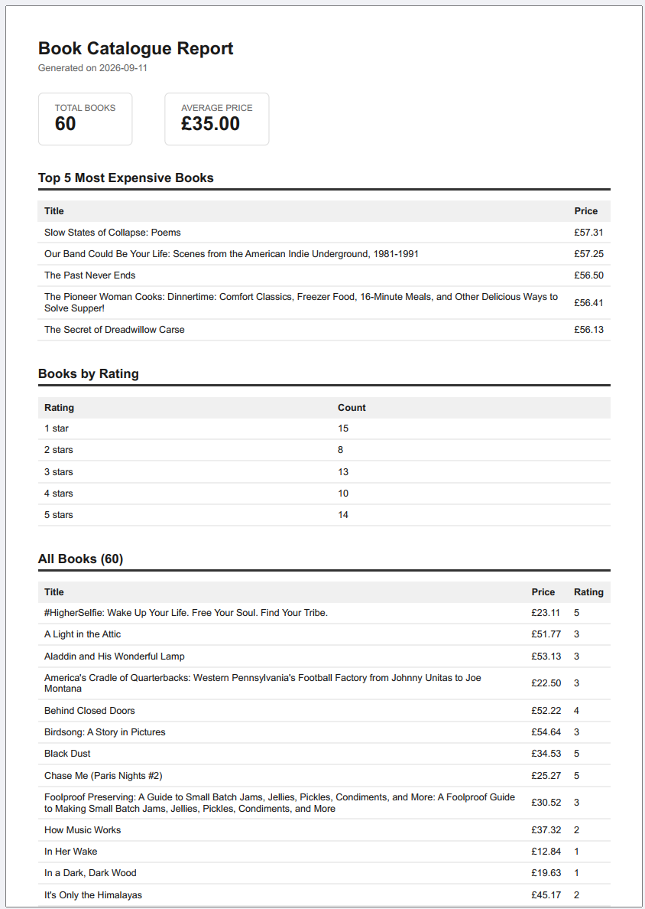

# PDF Report Generator

A small pipeline that queries a SQLite database, renders the results into a real PDF report using a headless browser, and serves the finished file by link through a FastAPI endpoint — no background jobs required.

## What this is

`POST /reports` runs the whole pipeline in one request: query the database, build an HTML report, print it to a PDF with Playwright, save it to disk, and return a link. `GET /reports/:id` returns the report's metadata, and `GET /reports/:id/file` downloads the actual PDF.

## Dataset

**Bookstore data**, reusing the 60 real book records collected by the [A9 scraper](../scraper/) from books.toscrape.com. `seed.py` reads `../scraper/output/books.json` and loads it into a fresh `report.db`, converting the scraper's word-based star ratings ("Three") into numbers (3) for aggregation.

## How to run it

1. Make sure the A9 scraper has already run at least once, so `../scraper/output/books.json` exists.

2. Install dependencies:
```bash
pip install fastapi uvicorn playwright
python -m playwright install chromium
```

3. Seed the database (safe to run more than once — it deletes and reloads, never duplicates):
```bash
python seed.py
```

4. Start the API:
```bash
uvicorn main:app --reload --port 8001
```

5. Generate a report:
```bash
curl -i -X POST http://localhost:8001/reports
```

6. Download it:
```bash
curl -o my-report.pdf http://localhost:8001/reports/file
```

## Aggregation SQL

```sql
-- Total books
SELECT COUNT(*) AS count FROM books;

-- Average price
SELECT AVG(price) AS avg_price FROM books;

-- Top 5 most expensive
SELECT title, price FROM books ORDER BY price DESC LIMIT 5;

-- Books grouped by star rating
SELECT rating, COUNT(*) AS count FROM books GROUP BY rating ORDER BY rating;
```

## POST → download proof

```
PS> Measure-Command { Invoke-WebRequest -Uri http://localhost:8001/reports -Method POST }
TotalSeconds: 4.24

PS> Invoke-WebRequest -Uri http://localhost:8001/reports/1/file -OutFile my-report.pdf
```

The downloaded file matched the actual file saved on disk (`reports/1.pdf`) byte for byte — confirming the "store and link, don't pass bytes around" pattern: `POST /reports` and `GET /reports/:id` only ever return small JSON, and only `GET /reports/:id/file` moves the PDF's actual bytes.

## Stage 4 — feeling the wait

A single `POST /reports` call took **~4.2 seconds** — that's Playwright launching a real headless Chromium instance, rendering a full multi-page HTML report, and printing it to PDF, all synchronously inside the request. At this size (60 rows) it's tolerable for one user clicking one button. If this dataset grew to thousands of rows, or multiple users generated reports concurrently, I'd move generation into a background job (the same Inngest pattern from the BE-09 AI Decision Flow assignment) — `POST /reports` would return `202` and an id immediately, an Inngest function would run query → render → save as separate durable steps, and `GET /reports/:id` would report `pending` until the file was ready.

## Stage 5 — idempotency

**What this protects against:** A user double-clicking "Generate Report," a flaky frontend retrying a slow request, or a script accidentally firing the same request twice. Without this check, each duplicate call would silently create a redundant PDF and waste another 4+ seconds re-rendering identical data.

**Real-world cost example:** An e-commerce system that emails a customer two separate order confirmations for the same order looks broken and erodes trust — even though technically "it worked" both times. The fix is the same shape here: check whether the effect has already happened today before doing it again.

Proof: two rapid `POST /reports` calls both returned `{"id": 1, ...}` with status `200` (not `201`), and `reports/` gained zero new files. Passing `{"force": true}` correctly bypassed the check and created report `id: 2` with a genuine `201`.

## Report screenshot



*(Screenshot: title, generation date, two total boxes (Total Books, Average Price), followed by the Top 5 Most Expensive Books table.)*

## Architecture

- `seed.py` — loads scraped book data into `report.db`, idempotently
- `report_queries.py` — all SQL: the four aggregations plus the `reports` bookkeeping table (insert, lookup by id, lookup latest-today)
- `render.py` — builds the HTML report and prints it to PDF via Playwright, with page-break-safe CSS (`break-inside: avoid`, repeating `<thead>`)
- `main.py` — the three routes: generate, get metadata, download file
